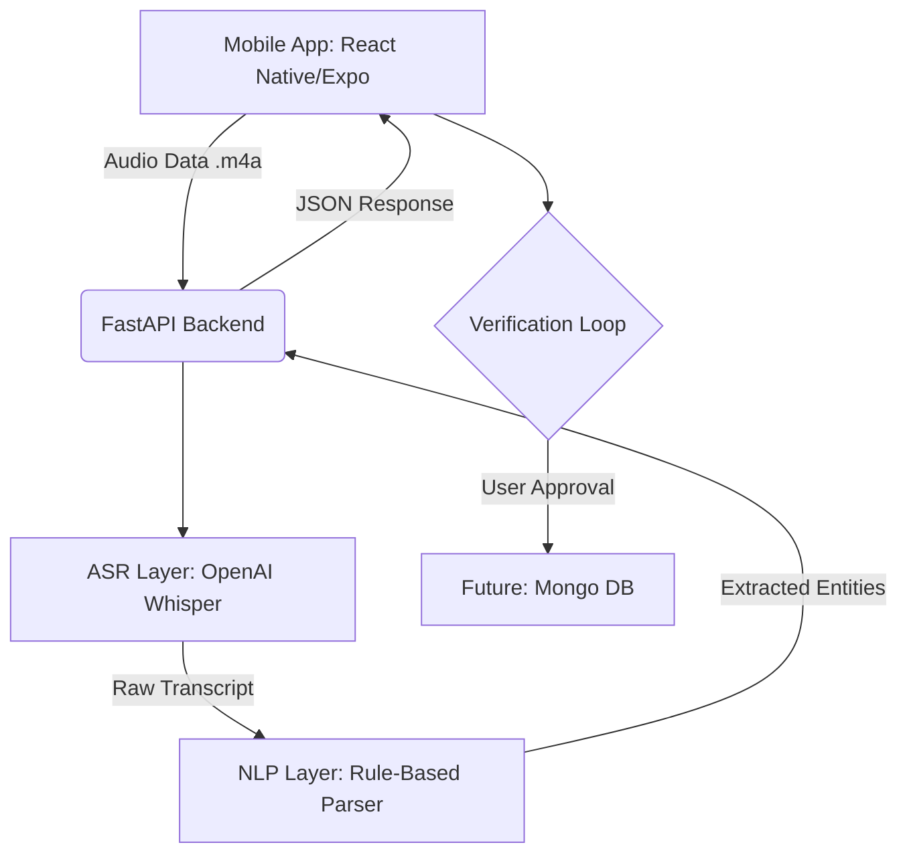

# 📦 Invora: Voice-Powered Multilingual Inventory Intelligence

### Empowering MSMEs with the "Bolo" (Speak) Interface

[](https://github.com/afianas/Invora_Voice_Commerce)
[](https://github.com/afianas/Invora_Voice_Commerce)

---

## 🚀 The Essence of Invora

**Invora** is a high-accessibility mobile inventory management system specifically designed for MSMEs (Small Suppliers and Shopkeepers). While traditional inventory software assumes English literacy and complex keyboard input, Invora replaces the office desk with the warehouse floor.

By combining **OpenAI Whisper ASR** with a domain-specific **Smart NLP Engine**, Invora enables warehouse operators to manage stock using natural voice commands in **Malayalam, Hindi, and English**.

> "Inventory management built for the speed of the warehouse door—not the office desk."

---

## 🏗 System Architecture

Invora follows a modern, decoupled architecture to ensure low-latency processing and accurate entity extraction.



---

## ✨ Core Features

### 🎙 The 'Bolo' Interface
Designed for the "warehouse floor," the interface prioritizes voice-first interaction. A single, prominent recording action captures commands in the user's native tongue, reducing the friction of manual data entry by over 70%.

### 🧠 Rule-Based NLP Engine & ASR
Invora utilizes the **Whisper 'small' model** for high-accuracy multilingual transcription. The raw text is then passed to our Smart Parsing layer which extracts:
- **Product** (e.g., Sugar, Milk, Steel)
- **Quantity** (e.g., 5, 20, 100)
- **Unit** (e.g., kg, litres, packets)
- **Action** (Add to stock or Sell/Remove)

### 🛡 Verification Loop (Human-in-the-loop)
To ensure 100% data integrity, Invora features a modal-driven verification step. Users review the AI's extraction, adjust fields if necessary, and confirm before the inventory is updated.

### 📊 Business Intelligence: ABC Analysis
Invora incorporates **Pareto-based ABC Revenue Analysis** directly into the dashboard. 
- **Category A**: High-value/High-frequency items (Gold)
- **Category B**: Moderate value (Silver)
- **Category C**: Low value (Bronze)
This allows suppliers to prioritize stock levels for their most critical revenue generators.

---

## 🛠 Tech Stack

| Component | Technology | Role |
| :--- | :--- | :--- |
| **Frontend** | React Native (Expo) | Cross-platform Accessibility |
| **Backend** | FastAPI (Python) | High-performance Async API |
| **ASR** | OpenAI Whisper | Multilingual Speech-to-Text |
| **NLP** | RapidFuzz + Regex | Fuzzy Matching & Smart Parsing |
| **Design** | Vanilla CSS / Custom | Premium Professional Aesthetic |

---

## 🌍 Multilingual Command Examples

Invora understands commands across the linguistic spectrum of the Indian warehouse.

### 🇬🇧 English
```bash
"Add 50 kg Sugar"
"Remove 10 litres of Milk"
```

### 🇮🇳 Hindi
```bash
"50 किलो चीनी जोड़ो" (50 kg Chini jodo)
"10 लीटर दूध निकालो" (10 litre doodh nikalo)
```

### 🇮🇳 Malayalam
```bash
"50 കിലോ പഞ്ചസാര ചേർക്കുക" (50 kilo panchasara cherkuka)
"10 ലിറ്റർ പാൽ ഒഴിവാക്കുക" (10 litre paal ozhivakkuka)
```

---

## ⚖ Technical Trade-offs

During development, critical architectural choices were made to optimize for the MSME environment:

- **Whisper vs. Google STT**: We chose **OpenAI Whisper** (Small Model) over Google Cloud STT. While Google offers high speed, Whisper provides superior accuracy for heavily accented regional speech and holds the potential for **local/offline deployment**, which is crucial for rural connectivity scenarios.
- **Rule-Based NLP vs. LLM**: We implemented a rule-based parser with **Fuzzy Matching** (RapidFuzz) for entity extraction. This ensures deterministic results and significantly lower latency compared to calling an LLM (like GPT-4), ensuring the app remains snappy on the warehouse floor.

---

## 🚀 Future Roadmap

- **NER Transition**: Transition from Rule-Based parsing to a dedicated **Named Entity Recognition (NER)** model (fine-tuned spaCy or DistilBERT-base-NER) for better handling of varied sentence structures and slang.
- **Traffic Light Confidence**: Implement a color-coded verification modal. Fields with high AI confidence will be highlighted in **Green**, while low-confidence captures will show in **Yellow/Red** to prompt closer inspection.
- **Persistent Storage**: Scaling the current single-warehouse optimized system to a robust **MongoDB Atlas** tier for multi-device sync and historical data persistence.

---

## 🛠 Build & Setup Guide

### Backend (FastAPI)
1. Navigate to directory: `cd backend`
2. Install dependencies: `pip install -r requirements.txt`
3. Run server: `uvicorn src.main:app --reload`

### Frontend (Expo)
1. Navigate to directory: `cd frontend`
2. Install dependencies: `npm install`
3. Start Expo: `npx expo start`

### Production Build (Android APK)
Invora uses **EAS CLI** for production APK builds:
```bash
eas build -p android --profile preview
```

---

## 📸 Screenshots & Demo

### App Flow & Architecture
<div align="center">
  
  
</div>

### Visual Interface
<div align="center">
  <table>
    <tr>
      <td align="center"></td>
      <td align="center"></td>
      <td align="center"></td>
    </tr>
  </table>
</div>

### 📺 Demo Video
[Watch the Invora Demo](https://drive.google.com/file/d/19N4Rm2TWIm_VSkBs0wgSCTwNRzbMutI1/view?usp=drivesdk)

---

## 👥 Team Members
* **Afia Nasumudeen** – Backend & Frontend-Backend Integration
* **Akshara C A** – Frontend Development

---

Made with ❤️ for inclusive commerce by **Team Invora**.
