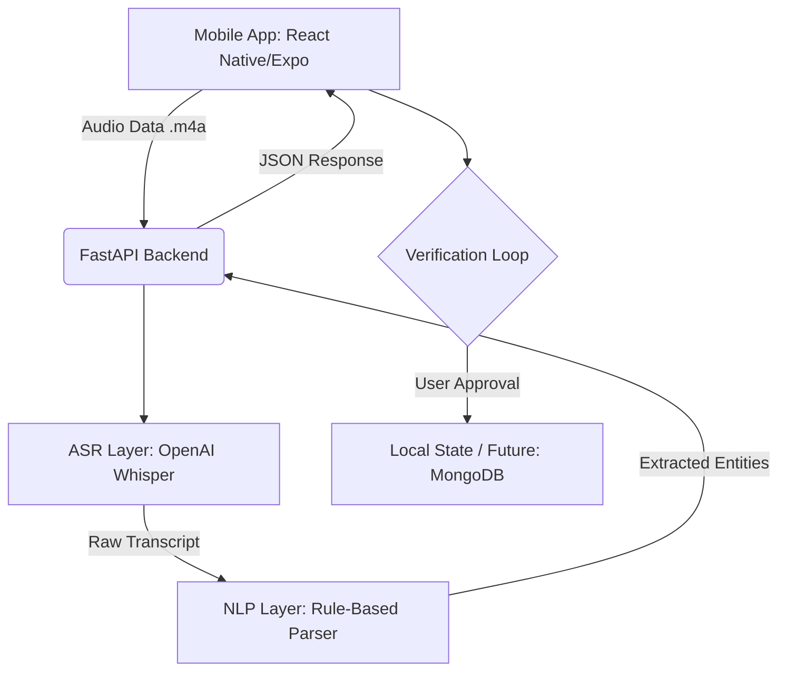

# 📦 Invora: Voice-Powered Multilingual Inventory Intelligence

### Empowering MSMEs with the "Bolo" (Speak) Interface

[](https://github.com/afianas/Invora_Voice_Commerce)
[](https://github.com/afianas/Invora_Voice_Commerce)

---

### Demo Video
[Watch the Invora Demo](https://drive.google.com/file/d/19N4Rm2TWIm_VSkBs0wgSCTwNRzbMutI1/view?usp=drivesdk)

### Visual Interface
<div align="center">
  <table>
    <tr>
      <td align="center"></td>
      <td align="center"></td>
      <td align="center"></td>
    </tr>
  </table>
</div>

### App Flow & Architecture
<div align="center">
  
  
</div>

---

## 🚀 The Essence of Invora

**Invora** is a high-accessibility mobile inventory management system specifically designed for MSMEs (Small Suppliers and Shopkeepers). While traditional inventory software assumes English literacy and complex keyboard input, Invora replaces the office desk with the warehouse floor.

By combining **OpenAI Whisper ASR** with a domain-specific **Smart NLP Engine**, Invora enables warehouse operators to manage stock using natural voice commands in **Malayalam, Hindi, and English**.

> "Inventory management built for the speed of the warehouse door—not the office desk."

---
### Tech Stack
| Component | Technology | Role |
| :--- | :--- | :--- |
| **Frontend** | React Native (Expo) | Cross-platform Accessibility |
| **Backend** | FastAPI (Python) | High-performance Async API |
| **ASR** | OpenAI Whisper | Multilingual Speech-to-Text |
| **NLP** | RapidFuzz + Regex | Fuzzy Matching & Smart Parsing |
| **Design** | Vanilla CSS / Custom | Premium Professional Aesthetic |

## ✨ Core Features

### 🎙 The 'Bolo' Interface
Designed for the "warehouse floor," the interface prioritizes voice-first interaction. A single, prominent recording action captures commands in the user's native tongue, reducing the friction of manual data entry by over 70%.

### 🧠 Rule-Based NLP Engine & ASR
Invora utilizes the **Whisper 'small' model** for high-accuracy multilingual transcription. The raw text is then passed to our Smart Parsing layer which extracts:
- **Product** (e.g., Sugar, Milk, Steel)
- **Quantity** (e.g., 5, 20, 100)
- **Unit** (e.g., kg, litres, packets)
- **Action** (Add to stock or Sell/Remove)

### 📊 Business Intelligence: ABC Analysis
Invora incorporates **ABC Revenue Analysis** directly into the dashboard. 
- **🥇 Category A (Gold)**: High-value/High-frequency items (Top 20% products driving 80% revenue).
- **🥈 Category B (Silver)**: Moderate value products.
- **🥉 Category C (Bronze)**: Low value/Slow-moving items.

### 🛡 Verification Loop (Human-in-the-loop)
To ensure 100% data integrity, Invora features a modal-driven verification step. Users review the AI's extraction, adjust fields if necessary, and confirm before the inventory is updated.

---

### System Architecture
Invora follows a modern, decoupled architecture to ensure low-latency processing and accurate entity extraction.



### Technical Trade-offs
- **Whisper vs. Google STT**: We chose **OpenAI Whisper** over Google Cloud STT for superior accuracy with regional accents and the potential for **local/offline deployment**.
- **Rule-Based NLP vs. LLM**: We implemented a rule-based parser with **Fuzzy Matching** for entity extraction. This ensures deterministic results and significantly lower latency compared to calling an LLM (like GPT-4).

---

## 🌍 Multilingual Examples

Invora understands commands across the linguistic spectrum of the Indian warehouse.

### 🇬🇧 English
```bash
"Add 50 kg Sugar"
"Remove 10 litres of Milk"
```

### 🇮🇳 Hindi (हिन्दी)
```bash
"50 किलो चीनी जोड़ो" (50 kg Chini jodo)
"10 लीटर दूध निकालो" (10 litre doodh nikalo)
```

### 🇮🇳 Malayalam (മലയാളം)
```bash
"50 കിലോ പഞ്ചസാര ചേർക്കുക" (50 kilo panchasara cherkuka)
"10 ലിറ്റർ പാൽ ഒഴിവാക്കുക" (10 litre paal ozhivakkuka)
```

---

## 🛠 Setup & Build Guide

### 📋 Prerequisites
- **Python 3.8+**
- **Node.js 18+**
- **FFmpeg**: Essential for Whisper audio processing.
  - *Windows*: `choco install ffmpeg`
  - *macOS*: `brew install ffmpeg`

### Backend (FastAPI)
1. `cd backend`
2. `pip install -r requirements.txt`
3. `uvicorn src.main:app --reload`

### Frontend (Expo)
1. `cd frontend`
2. `npm install`
3. `npx expo start`

---

## 🚀 Future Roadmap
- **NER Transition**: Dedicated Named Entity Recognition (NER) model for slang handling.
- **Traffic Light Confidence**: Color-coded verification based on AI confidence levels.
- **Persistent Storage**: Migration to **MongoDB Atlas** for multi-device sync.

---

## 👥 Team Invora
* **Afia Nasumudeen** – Backend & Frontend-Backend Integration
* **Akshara C A** – Frontend Development

---
Made with ❤️ for inclusive commerce by **Team Invora**.
